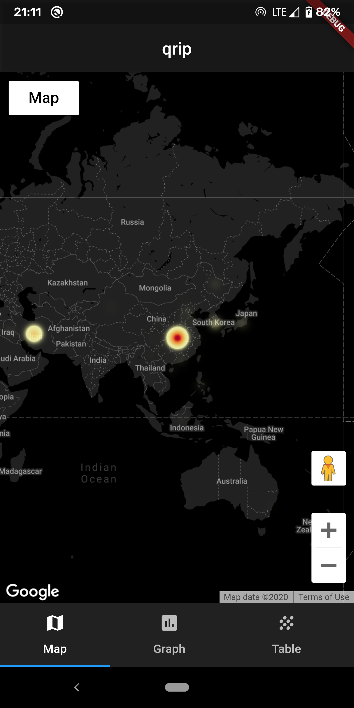

# fucorona

## Getting Started

This project is a starting point for a Flutter application.

This is an analytics application for COVID-19. It contains maps, graph and table view for the reports.

The data is taken from -  
https://github.com/CSSEGISandData/COVID-19
Data from Johns Hopkins CSSE. 

MapView |
:-------------------------:|
  

GraphView             |  GraphView  |   GraphView
:-------------------------:|:-------------------------:|:-------------------------:
  |   |  

TableView  |  TableView
:-------------------------:|:-------------------------:
  |  